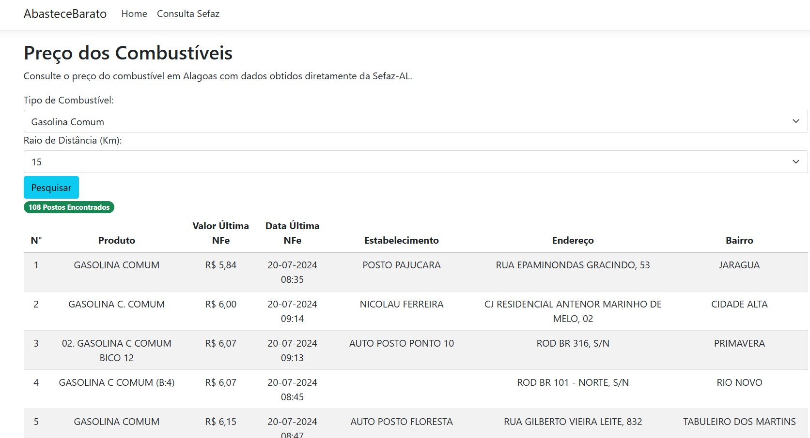

 
 <!-- Improved compatibility of back to top link: See: https://github.com/othneildrew/Best-README-Template/pull/73 -->
<a id="readme-top"></a>


[![Contributors][contributors-shield]][contributors-url]
[![Forks][forks-shield]][forks-url]
[![Stargazers][stars-shield]][stars-url]
[![Issues][issues-shield]][issues-url]
[![MIT License][license-shield]][license-url]
[![LinkedIn][linkedin-shield]][linkedin-url]


<!-- PROJECT LOGO -->
<br />
<div align="center">
  <a href="https://github.com/othneildrew/Best-README-Template">
    
  </a>
</div>


<!-- TABLE OF CONTENTS -->
<details>
  <summary>Table of Contents</summary>
  <ol>
    <li>
      <a href="#sobre-o-projeto">Sobre o Projeto</a>
      <ul>
        <li><a href="#ferramentas">Ferramentas</a></li>
      </ul>
    </li>
    <li>
      <a href="#iniciando-o-projeto">Iniciando o Projeto</a>
      <ul>
        <li><a href="#pre-requisitos">Pré Requisitos</a></li>
        <li><a href="#tecnolocias">Tecnologias</a></li>
      </ul>
    </li>       
    <li><a href="#contribuindo">Contribuições</a></li>
    <li><a href="#license">Licença</a></li>
    <li><a href="#contato">Contato</a></li>
    
  </ol>
</details>


<!-- ABOUT THE PROJECT -->
## Sobre o Projeto

[![Product Name Screen Shot][product-screenshot]](https://example.com)

Projeto Abastece Barato Alagoas

Informações:
* Pesquisa preços dos combustíveis no Estado de Alagoas;
* Pesquisa realizada em tempo real com base na localização do usuário;
* Dados precisos e consistentes pois vem diretamente da API da Sefaz Alagoas.
* Dados são baseados na emissão das últimas NFs.

Lembre-se de exigir sua NF pois é com ela que garantiremos combustível de qualidade para os nossos veículos, com ela você tem prova de onde abasteceu caso seu veículo venha a dar algum problema, a exigência da NF diminui também os casos de adulteração do combustível além de evitar a sonegação fiscal.


<p align="right">(<a href="#readme-top">back to top</a>)</p>


### Ferramentas

Para criação deste projeto utilizaremos ferramentas como:
* Microsoft Visual Studio;
* Visual Studio Code;
* Ou outra IDE/Editor de código de sua preferência.

Utilizaremos também, a linguagem de programação C# e Frameworks como o Entity Framework Core. É desejável que você saiba os conceitos básicos para criação de páginas ASP.NET Core utilizando razor pages.

# Tecnologias

* 
* 


## Frameworks
* 

## Iniciando o projeto

Siga as instruções abaixo para darmos início ao projeto

1. Solicite seu Api Token da Sefaz AL [https://economizaalagoas.sefaz.al.gov.br/desenvolvedor.htm](https://economizaalagoas.sefaz.al.gov.br/desenvolvedor.htm) com o Token em "mãos";
2. Clone o repositório
   ```sh
   git clone https://github.com/mateusneko/AbasteceBaratoAL.git
   ```
3. Instale o Entity Framework Core
   ```sh
   dotnet add package Microsoft.EntityFrameworkCore
   dotnet add package Microsoft.EntityFrameworkCore.Tools
   ```
   
4. Adicione sua ApiToken em `appsettings.json` ou na própria PageModel do seu projeto.
   ```js
    ApiToken: "ENTER YOUR API";
   ```

<p align="right">(<a href="#readme-top">back to top</a>)</p>


<!-- CONTRIBUTING -->
## Contribuindo

Contribuições são o que tornam a comunidade de código aberto um lugar incrível para aprender, inspirar e criar. Qualquer contribuição que você fizer será **muito apreciada**.

Se você tiver uma sugestão que possa melhorar este projeto, faça um fork do repositório e crie um pull request. Você também pode simplesmente abrir uma issue com a tag "enhancement".
Não se esqueça de dar uma estrela ao projeto! Obrigado novamente!

1. Faça um fork do projeto
2. Crie sua branch de funcionalidade (`git checkout -b feature/AmazingFeature`)
3. Commit suas mudanças (`git commit -m 'Add some AmazingFeature'`)
4. Faça o push para a branch (`git push origin feature/AmazingFeature`)
5. Abra um Pull Request


<p align="right">(<a href="#readme-top">back to top</a>)</p>


<!-- LICENSE -->
## License

Distributed under the MIT License. See `LICENSE.txt` for more information.

<p align="right">(<a href="#readme-top">back to top</a>)</p>


<!-- CONTACT -->
## Contato

* [](https://www.linkedin.com/in/mateus-deandrade/)


## Link do Projeto


* Project Link:  [](https://github.com/mateusneko/AbasteceBaratoAL/)

<p align="right">(<a href="#readme-top">back to top</a>)</p>


<!-- MARKDOWN LINKS & IMAGES -->
<!-- https://www.markdownguide.org/basic-syntax/#reference-style-links -->
[contributors-shield]: https://img.shields.io/github/contributors/mateusneko/AbasteceBaratoAL.svg?style=for-the-badge
[contributors-url]: https://github.com/mateusneko/AbasteceBaratoAL/graphs/contributors
[forks-shield]: https://img.shields.io/github/forks/mateusneko/AbasteceBaratoAL.svg?style=for-the-badge
[forks-url]: https://github.com/mateusneko/AbasteceBaratoAL/network/members
[stars-shield]: https://img.shields.io/github/stars/mateusneko/AbasteceBaratoAL.svg?style=for-the-badge
[stars-url]: https://github.com/mateusneko/AbasteceBaratoAL/stargazers
[issues-shield]: https://img.shields.io/github/issues/mateusneko/AbasteceBaratoAL.svg?style=for-the-badge
[issues-url]: https://github.com/mateusneko/AbasteceBaratoAL/issues
[license-shield]: https://img.shields.io/github/license/mateusneko/AbasteceBaratoAL.svg?style=for-the-badge
[license-url]: https://github.com/mateusneko/AbasteceBaratoAL/blob/master/LICENSE.txt
[linkedin-shield]: https://img.shields.io/badge/-LinkedIn-black.svg?style=for-the-badge&logo=linkedin&colorB=555
[linkedin-url]: https://www.linkedin.com/in/mateus-deandrade/